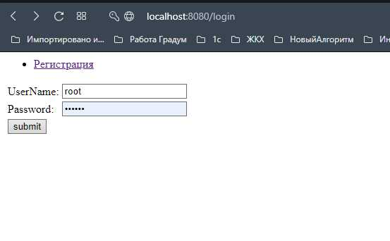
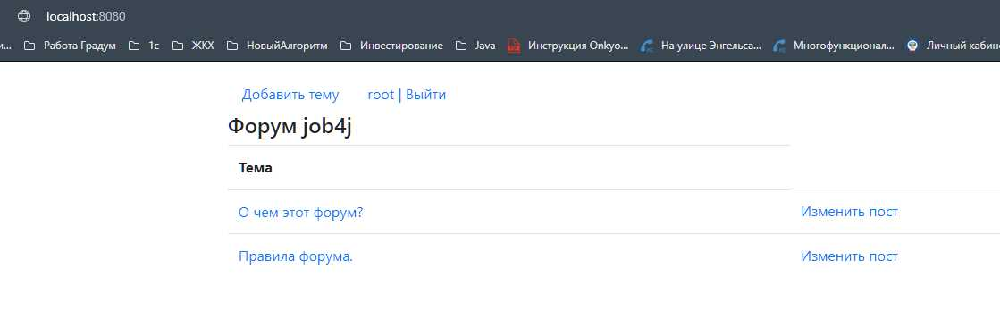
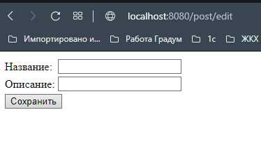

Forum
====================================================
Project: Simple forum.
----------------------------------------------------
Account registration is available. After registration, it is possible
to authenticate on the site, create and edit posts. 
The project uses Spring boot, Spring Security, Hibernate.

Configuration
----------------------------------------------------
The project should be configured the Spring Boot.

Usage
----------------------------------------------------
- 1.Registration.
The first time you log in, you will be automatically redirected 
to the registration page.
Enter login and password.
- 2.Authorisation.
Page /login.
Enter login and password.
- 3.Addind post. On the main page choose "Добавить тему". Than enter "Название" and "Описание". 

